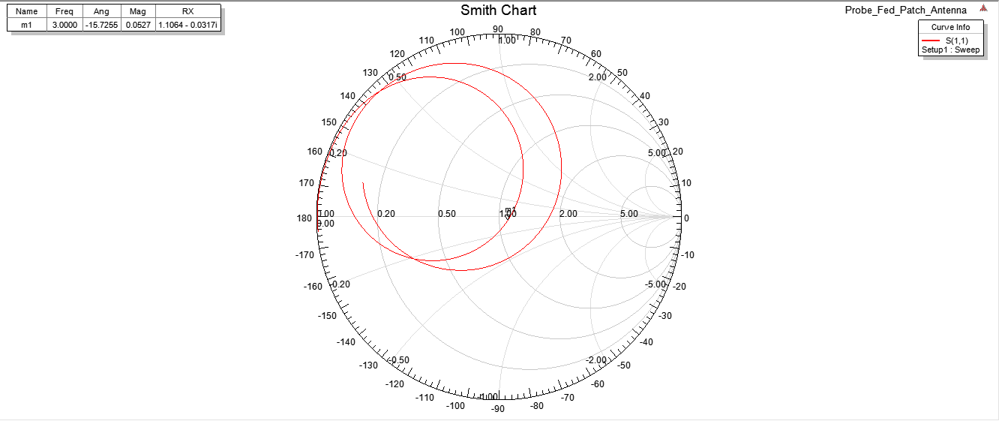

# Lab 9 Report

## Background
 
The Microstrip Patch Antenna is a rectangular antenna characterized by it's length and width. The length of the antenna determines the operating frequency, while the width controls the impedance. Edge effects lead to a longer electrical length than physical length, which is accounted for in the design. To maximize the amount of power radiated by the patch, a stub is used to match the patch to the feeding circuitry. 

## Design
The patch was designed to target a 3 GHz operating frequency. The dimensions were calculated as follows: 

 

The load was measured using the Network analyzer, and the patch demonstrated a resonant frequency of 3.11 GHz. The stub matching version of the antenna was matched to this frequency using a smith chart.  
 

## Procedure
The patch antenna was designed to the specifications in the lab manual, and constructed during lab using copper tape. The load impeadance of the patch was determined using the network analyzer, and a single stub was used to match the patch to the feedline. The device was then simulated in HFSS to compare with the measured results. 

## Results and Discussion
 
The unmatched patch shows a resonant frequency of 3.11 GHz on this chart. When the stub matching network is added to the patch, the VSWR drops to nearly 1 (which is the ideal value.) The simulated version of the patch is successfully matched to exactly 3 GHz. 

The marker m1 shows the load experienced by the simulated patch at 3 GHz. Ideally, the load should be centered at z=1+0j at this frequency. The load shown is 1.1064 -.032j which is very cloase to the ideal value. 

## Conclusion
A patch antenna was constructed with copper tape in lab and simulated in HFSS. The version constructed in lab ended up with a Resonant frequency of 3.11 GHz because the length was slightly shorter than designed, while the simulated version had a resonant frequency of 3 GHz as designed. 

