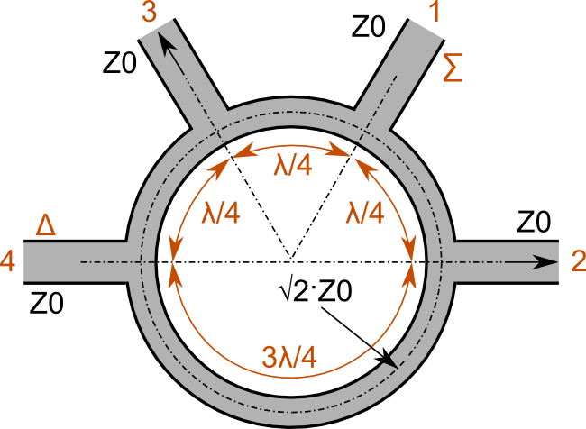

# Lab 8 Report
Jared Pocock

## Background
For this lab, a rat race coupler and a hybrid coupler were simulated in HFSS. These devices are used to sum two in phase signals, split a single incoming signal or as part of a phase shifter.

## Design
The hybrid coupler should be designed to the following specifications

The rat race coupler should be designed to the following specification

The measurements had to be adjusted a little to make the parameters accurate at the design frequency. Both impedances had to be bigger than what was calculated.

## Procedure
Not much of a procedure. Just adjust the line widths to the correct number until the plots look accurate.

## Results and Discussion
The simulated and measured results were pretty close to one another for the hybrid coupler.

Port 4 shows isolation, power splitting is done on ports 2 and 3, and port matching is done on port 1. It's possible that if the simulation was tweaked a little further, the accuracy could be better between the two.

The rat race coupler was a little different. While port 4 shows agreement with the measurements, port 1 does not. It's possible that the values used for the simulation were wrong. However, ports 2 and 3 are in pretty good agreement with each other.

Port 4 shows isolation, power splitting is done on ports 2 and 3, and port matching is shown at port 1.

For the phase difference, the simulated and measured values seem to be off by a constant factor, which again suggest that the simulated T-line length was not the right value and more adjustments need to be made, especially concerning the values near the end of the chart.

These devices could be used for power splitter and phase shifting since the signals at port 1 and port 4 are 180 degrees out of phase with each other.

Using matched loads when measuring, prevents any noise from showing up in the S-paramter measurments.

## Conclusion
While some areas of the lab were successful like the hybrid coupler, smaller errors within the simulations of the rat race coupler gave incorrect results. This could be fixed by adjusting the T-line width and circumference of the ring in HFSS.

As with the rat race coupler, the hybrid coupler could be adjusted slightly as well to match better with the S-parameter curves. This would also help with the phase difference as well.

## Hindsight
I wish I knew more about HFSS than I do.

## Reflection
The most challenging would be using HFSS since I'm not that familiar with it. The rewarding part was just getting values that are close to expected.
