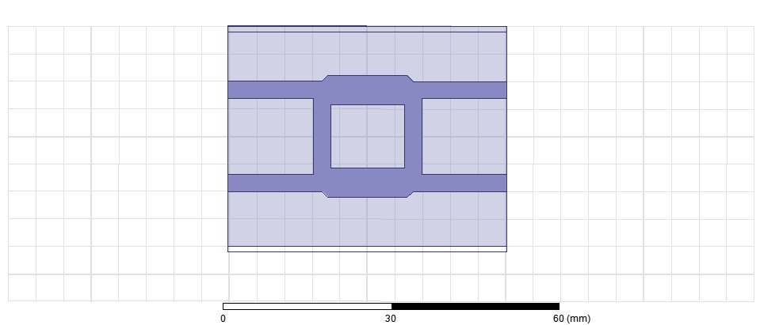
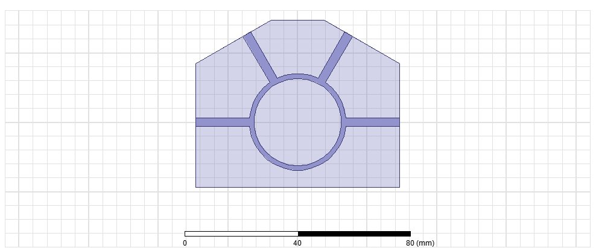

# Lab 8 Report
Joshua Ruff

## Background
The Hybrid coupler and Rat Rase couplers are four port divices in which the power input into one port is divided between two output ports and isolated from the fourth. The Hybrid coupler provides 90 degrees of phase shift in the out of phase port, while the Rat Race coupler provides 180 degrees in the out of phase port. The phase difference on the rat-race allows it to be used to output the sum and difference of input signals. 

## Design
###Hybrid Coupler

All interconnections of the hybrid coupler are quarter-wave. In the diagram, the vertical strips match the feedline impedance (50-Ohms), while the horizontal strips are scaled down to 35-Ohms. A microstrip line calculator was used to determine the physical lengths and widths. The 50 Ohm lines had a width of 3.13 mm and a length of 16.88 mm. The 35 Ohm lines had a width of 5.27 mm and a physical length of 16.47 mm. 

###Rat-Race Coupler

To achieve an equal power split, the interconnections in the Rat-Race coupler are all equally set to root 2 times the feed line impedance, or 71 Ohms. The three smaller interconnections are all quarter wave in length, while the longer interconnection is three-quarters of a wavelength long. Using the microstrip calculator, the feedline is determined ot have a width of 1.71 mm, and a length of 17.7 mm. The feedline had a width of 3.13 mm. 

## Procedure
These devices were designed and simulated in HFSS, and optimized as necessary. Afterwards they were compared to versions of the devices which were fabricated by a milling machine. When measuring S-parameters, matched loads were placed on each port to prevent signal from being reflected back into the device by unused ports. Such a reflection would prevent lead to an innacurate measurement. 

## Results and Discussion
###Hybrid Coupler
 
The S11 Plot shows the amount of power reflected by the input port. The resonance in each S11 demonstrates frequency the device is matched at. The milled S11 showed a match at 2.5 GHz, while the simulated version showed a match at closer to 2.8 GHz. The S41 parameter has minima at the same locations which demonstrates isolation between ports 1 and 4. S21 and S31 approach -3dB at 2.5 GHz for the milled version of the Hybrid and 2.8 for the phase shifted version, showng a decent half power split. The design frequency of 2.5 GHz  could be achieved in the simulation by lengthening the quarter-wave interconnects in the coupler to account for the overlap between connecting sections of microstrip. 

 
At the target frequency of 2.5 GHz, ports 2 and 3 have a targeted phase shift of 90 degrees. This is measured by subtracting the phase of S31 from S21 to and plotted above. The simulated design has closer to 85 degrees of phase difference at the target frequency, while the milled design rests at approximately 92 degrees. The simulated design's phase shift could be improved in similar fasion to the S11 matching discussed earlier, by lengthening the interconnects of the coupler. 
###RatRace Coupler
 
Unlike the hybrid coupler, the Rat-Race design didn't have any issues with overlapping sections of transmisison line, so The simulated and milled designs both demonstrated a match to the desired design frequency of 2.5 GHz. The S11 parameter demonstrates this match with it's minima near that frequency. The S41 Parameter also has a minima around 2.5 GHz, which demonstrates that port 4 is the isolation port. S21 and S31 are both around -3dB at 2.5 GHz which demonstrates an equal power split between ports 2 and 3. The milled design's S-Parameters correlate  closely to the simulated design; the differences between the two versions of the coupler are minimal. 

## Conclusion
The RatRace and Hybrid couplers were designed to split the power input at port one between ports 2 and 3 at 2.5 GHz. For the hybrid coupler, the simulated design frequency ran into issues with overlapping microstrip lines, and thus had a higher than desired match frequency. With the exception of this issue, the devices behaved as desired.  
