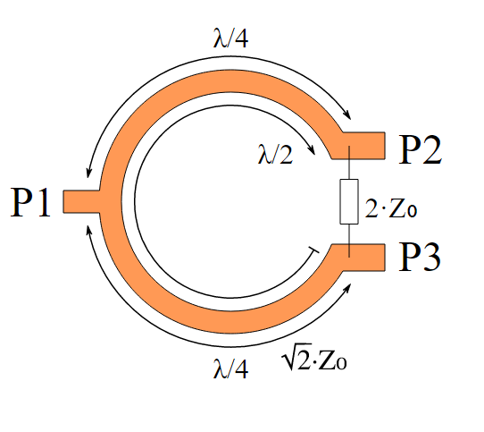
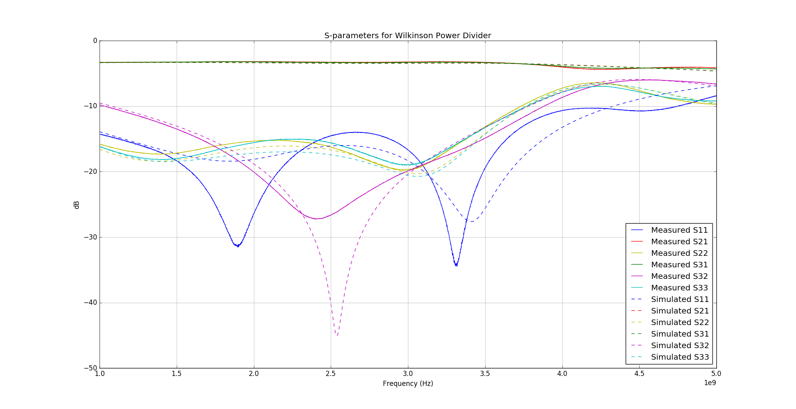
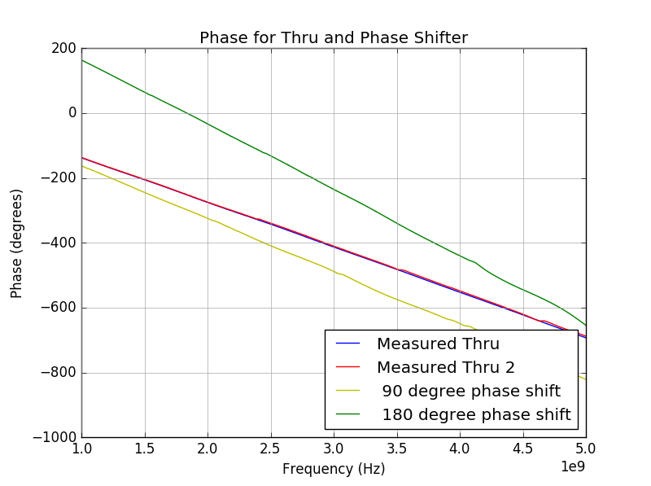

# Lab 7 Report
Jared Pocock

## Background
The two devices in this lab is the Wilkinson Power Divider and the Delay Line Phase Shifter. The Wilkinson Power Divider, as its name suggests, can split power without the two ports coupling to each other. The Delay Line Phase shifter can shift an incoming signal a certain amount of degrees based on its design.

## Design

The Wikinson Power Divider has to be designed to the following standard.

For the delay line shifter, using the usual online microstrip calculator, we know the parameters of the FR4 board and our design frequency (3 GHz) we can determine the QW length as 14.18 mm. We know that a length of lambda/8 gives us a phase shift of 45 degrees and adding a QW length will add 90 degrees of phase shift. Therefore, the phase shifter will be two lengths of 7.09 mm for a 90 phase shift and two lengths of 14.18 for a 180 degree phase shift.

## Procedure
The first step in the procedure is to measure and cut out a 50 ohm feedline and lay it across the board of FR4. The board was then measured by David to get our initial phase measurement. After adding the 90 degree and 180 degree phase shift sections onto the board we took the board back to David to measure the phase again to see if the phase shifting sections changed the phase at all. The feedline is cut and the 90 degree phase shift section is soldered to the feedline. The board is measured again to see if the phase changed 90 degrees. The 90 degree line is unsoldered and the 180 degree line is soldered in its place. The board is measured again to see if the phase changed 180 degrees.

## Results and Discussion
For the Wilkinson Power Divider, the results were somewhat as expected. S11 is fairly low which suggests that the port matching is pretty good. As expected, S21 and S31 are around -3dB which proves an equal power split between ports 2 and 3, one of the reasons for the resistor in the circuit. S23 is very low as well which shows that the two ports are pretty isolated as well, another reason for the circuit.

For the delay line phase shifter, the results are slightly off. For the first measurement, a phase of -413 degrees was measured. For the second measurement a phase of -410 was measured, suggest that having the two phase shifting sections near the feedline does not create a measurable coupling effect or if it does it's very slight. For the third measurment (90 degree), a measurement of -489 was recorded, a shift of 79 degrees. It's not 90 degrees, so the 90 degree sections is too short. Since the phase shift is (14.18/90) or .158 mm per degree, and since it's about 10 degrees off, the line needs to be extended about 1.5 mm. For the 180 degree measurement, a phase of about -235 was recorded, a difference of 175. Again since the difference is under, the line needs to be extended about .79 mm, a rather tough assignment when doing by hand. I'm not sure we could do better by hand. The adjustments that would need to be made would be so slight for the human eye, a machine would have to do.

## Conclusion
The Wikinson Power Divider and the delay line phase shifter worked fairly well for the lab. The results weren't perfect, but they were reasonably close showing that these designs could work in real life (and maybe if they were made by machine instead of human hands.)

## Hindsight
Again, I wish I knew about soldering more before these labs.

## Reflection
The most challenging part of the labs was the soldering part. The air guns make the copper tape lose their adhesive, so it was tough trying to keep things all together to solder to the board.
