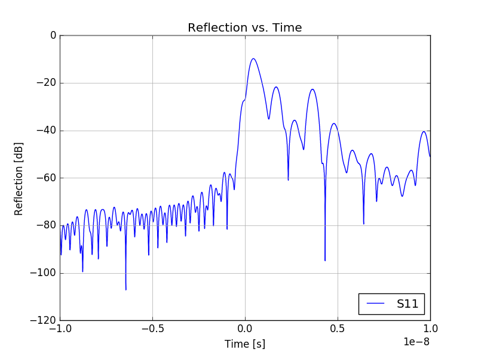
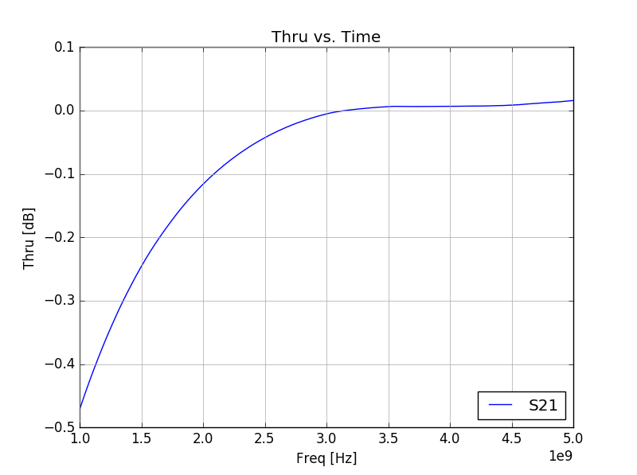
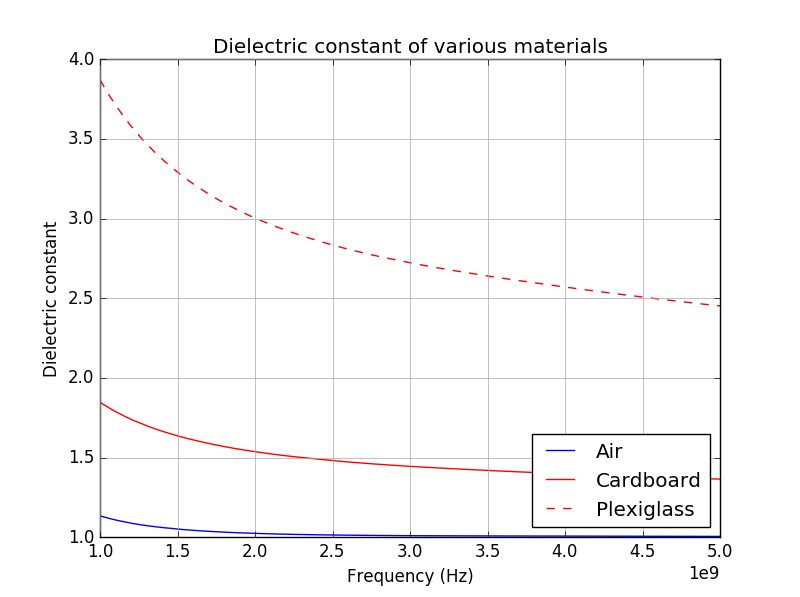

# Lab 11 Report
Jared Pocock

## Background
The purpose of this lab was to demonstrate GRL calibration and how antennas can be used to measure the dielectric constant of a material.

## Design
There were no design equations needed for the lab.

## Procedure
The first step in the lab was to connect the network analyzer to the transmitting horn antenna. Because of the connection to the antenna, there were a large amount of the reflection. The next step was to add the plate in between the antenna to see where the reflection pops up in the frequency domain. Once the relfection was found, the network analyzer used a fourier transform to convert the frequency domain to the time domain and gating was introduced to eliminate the surrounding noise around the reflection that we want. GRL calibration was next, first using the plate to block the signal from passing and measuring the reflect and then removing the plate to calculate the line measurement. When the network analyzer was calibrated, we inserted plates of plexiglass and cardboard as well as just air itself to measure the dielectric constant.

## Results and Discussion
The change from the frequency domain to the time domain is accomplished by using a Fourier transform. In the time domain, the S11 data shows up as simply the time it takes for the wave to reflect off of the plexiglass plate and travel back to the transmitting antenna which, in the case of the lab, was about 3.6 ns. 

The time domain helps the calibration by knowing at what times to gate the signal to eliminate the other noise in the signal. When putting in the reflect, we're looking for an increase in the S11 reflection to see where the signal is being bounced back to the antenna.

In the frequency domain, the S21 parameter is measured to see at what frequency does the transmission coefficient go to 0. Based on the data, the barrier shows up around 3 GHz when the transmission coefficient stay arounds 0.

For the dielectric constant measurements, the numbers were about what to expect for plexiglass, cardboard, and air. However, the antennas that we used for the measurments were rated to work above 2 GHz. Because of this, the data below 2 GHz may not be reliable.

## Conclusion
The key points of the lab was to understand the concept of why gating is necessary, to isolate a material for testing, along with changing from the frequency domain to the time domain.  The setup wasn't the best with makeshift material holders, and cables that cause reflections. While the setup isn't perfect by any means, we did get good measurements out of the lab. Plexiglass, cardboard, and air had values close to the known values they should have. Having a more controlled environment would definitely help with accuracy. 

## Hindsight
I wish I knew signal processing better than I do now.

## Reflection
It's definitely interesting seeing how dielectric constants of solids can be measured by using antennas instead of a probe.
