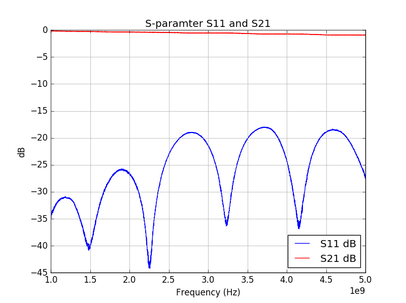
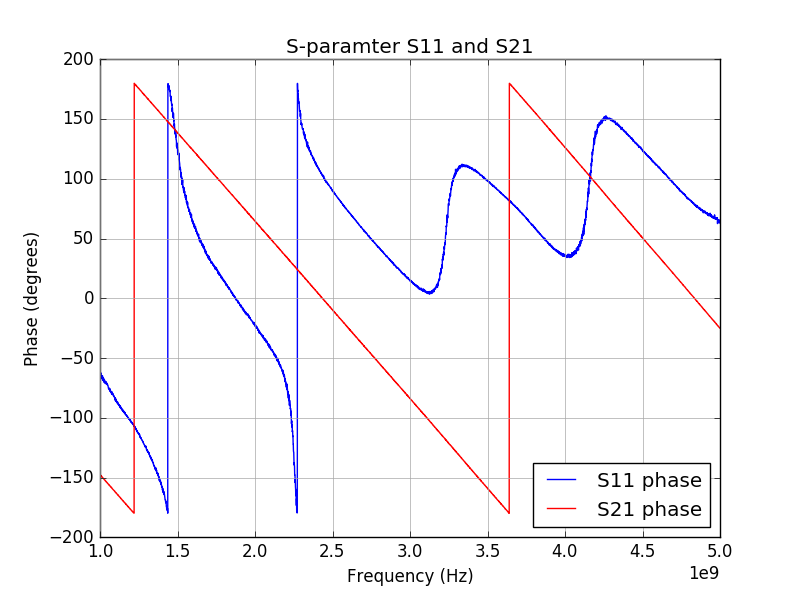
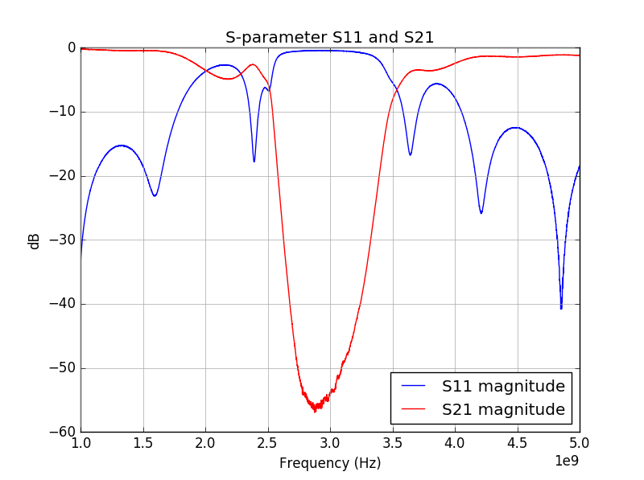
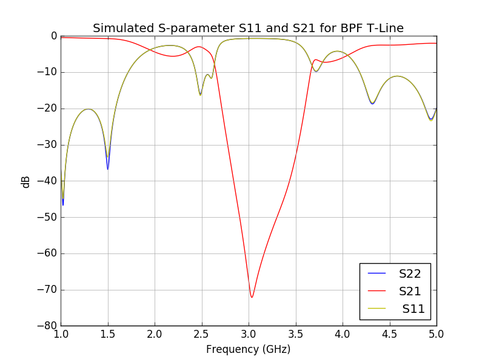
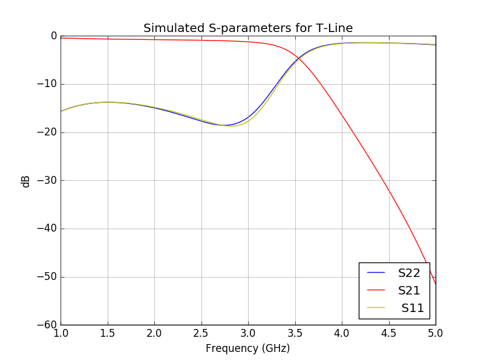
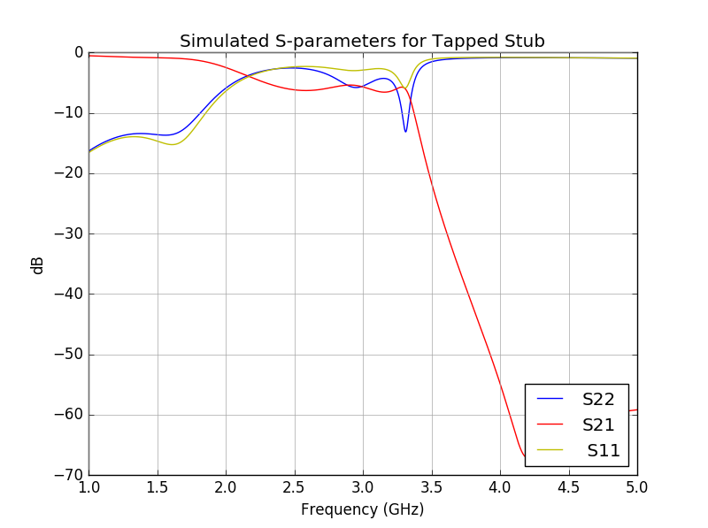

# Lab 6 Report
Jared Pocock

## Background
The goal of this lab was to build a band stop filter that would prevent transmission from 2.25 to 3.75 GHz. There were also Low Pass Filter designs that were simulated in HFSS, specifically a tapped stub design, and a transmission line model.

## Design
From the calculations in the pre-lab, the charateristic impedance of the thru line and center stub of the filter is 50 ohms, which when inputted to the online calculator gave a line width of 3 mm. From the pre-lab, we know that the other line widths for the stubs should be for 77 and 104 ohms should be 1.3 mm and .56 mm respectively. The lengths of all stubs were a quarter wavelength.

## Procedure
For the procedure in the physical part of the lab, the first step in the lab is to lay the copper tape across the FR4 board to act as the transmission line. The phase and magnitude of the 50 ohm T-line was measured. After that, the connectors on the ends of the transmission line are soldered onto the board. When that was finished, the stubs of copper tape were cut out to the widths and length needed. When the stubs were added, the magnitude and phase of the band stop filter were measured to see if the band-stop region is centered around the 3 GHz frequency.

## Results and Discussion
The results for the band stop filter were about what was expected. The 50 ohm feedline had a low insertion loss (near 0 dB) and the return loss was very small, varying from -20 dB to -45 dB.

The phase was also what was expected.

After the stubs were added in, creating a band stop filter, the band stop region was fairly good.

The band stop region is centered around 2.75 GHz instead of 3. Also, as expected, the S11 parameter (the return loss) is almost 0 in the band stop region. The phase shift is almost 90 degrees at 2.75 GHz which is to be expected at the band stop frequency.

The simulations from HFSS give similiar results.

For the simulations, the LPF T-line model was modeled to the z0lver file. The tapped stub was modeled using the equations in the pre-lab. However, both models overshoot the planned frequency for ending pass-through.

## Conclusion
Though the lab was far from perfect, the results in it did at least show the principles of a band stop filter, an extremely low S21 parameter at a center frequency and a small, if any, return loss as well.

The HFSS simulations were a little off as well, starting to block frequencies starting too high. This could change with tuning the circuit in HFSS.

## Hindsight
If there was something that I wish I could change, it's that I would be better at soldering. I've never soldered before but I wish I learned before taking this class.

## Reflection
The hardest part of the lab is to just make sure that the calculations are correct, even if the widths are super tiny. The best part of the lab is checking and measuring the circuit and getting good data. Knowing that the equations we learn in class actually work in real life is actually a really gratifying feeling for me.
